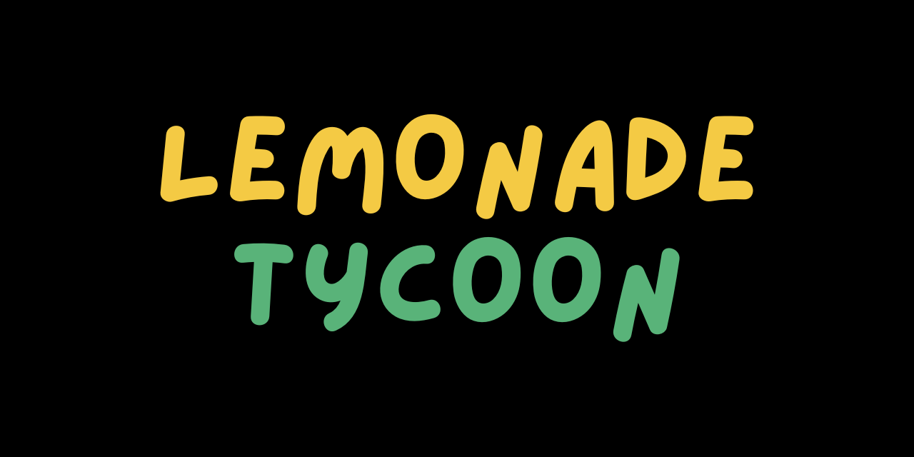

Lemonade Tycoon is a remake browser based fangame.

# Contributing

## 🛠️ Development

If you have the motivation and experience with Typescript/Javascript (or are willing to learn) please feel free to fork the repository and make pull requests with contributions. If you don't know what to work on but want to help, reference the below To-Do section.

### 💻 Environment Setup

#### Prerequisites

-   node: 18.20.3
-   yarn: [how to install](https://classic.yarnpkg.com/en/docs/install)

#### Running Locally

1. Clone the repo and in the root directory run `yarn install`
    - _if you run into any errors, reach out in the **#dev-corner** channel in discord_
2. Run `yarn start:dev` to locally run the project in `localhost:8000`

<!-- #### Linting

We're using Biome as our common linter and formatter. It will run automatically during the pre-commit hook but if you would like to manually run it, use the `yarn biome` script. To view the complete rules, check out the [biome.jsonc](./biome.jsonc) file. -->

<!-- ### 📚 Documentation

You can find the auto-generated documentation [here](https://pagefaultgames.github.io/pokerogue/main/index.html).
For information on enemy AI, check out the [enemy-ai.md](./docs/enemy-ai.md) file.
For detailed guidelines on documenting your code, refer to the [comments.md](./docs/comments.md) file. -->

<!-- ### ❔ FAQ -->

<!-- **How do I test a new **\_\_\_**?**

-   In the `src/overrides.ts` file there are overrides for most values you'll need to change for testing -->

<!-- **How do I retrieve the translations?**

-   The translations were moved to the [dedicated translation repository](https://github.com/pagefaultgames/pokerogue-locales) and are now applied as a submodule in this project.
-   The command to retrieve the translations is `git submodule update --init --recursive`. If you still struggle to get it working, please reach out to #dev-corner channel in Discord. -->

## 🪧 To Do

Check out [Github Issues](https://github.com/Gamez0/lemonade-tycoon/issues) to see how can you help us!

# 📝 Credits

> If this project contains assets you have produced and you do not see your name, **please** reach out, either [here on GitHub](https://github.com/Gamez0/lemonade-tycoon/issues/new).

Thank you to all the wonderful people that have contributed to the Lemonade Tycoon project!<!-- You can find the credits [here](./CREDITS.md).-->
