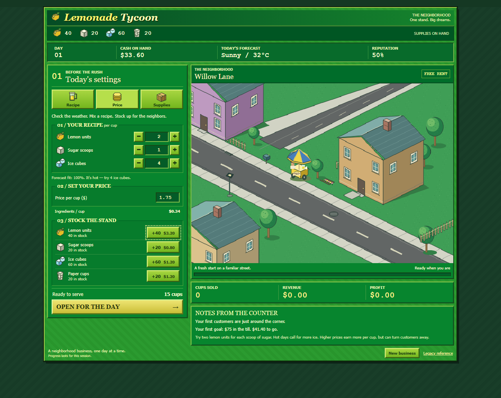

# Classic PC art and interface

User playtesting accepted the game loop but rejected the modern cream/card presentation. They explicitly requested old PC tycoon styling for the UI as well as the world. This is a presentation revision, not a change to economic rules.

## Reference and implementation

Inspected the original Windows [selling screen](https://www.mobygames.com/game/44300/lemonade-tycoon/screenshots/windows/854921/) and [Softpedia screenshots](https://games.softpedia.com/get/Shareware-Games/Lemonade-Tycoon.shtml) of park selection, selling, recipe and upgrades. Observations: diagonal streets, tall buildings framing a small parasol cart, dark outlines, fine environmental details, compact green panels, illustrated resources and beveled lime buttons. User preference supersedes the earlier cream-colored direction.

Rebuilt the neighborhood with a shared 2:1 ground projection, two diagonal roads, shaded walls and roofs, angled windows, chimney brick, fences, trees, mailbox, flowers, lamp and road details. Replaced the timber stand with an original small wheeled cart and segmented blue/yellow parasol. Redrew twelve customer textures and aligned their path and stop with the pavement/cart. Existing deterministic arrival, settlement and exit timing remains intact.

Replaced spacious cards with striped green chrome, inset panels, beveled buttons and dense resource/finance strips. Seven original SVG icons are code-authored and shared between inventory and controls. Section shortcut buttons focus real controls. Recipe +/- buttons use native input stepping and existing validation, and inherit the fieldset lock during selling. Counts remain visible while selling or viewing results.

## Review and validation

Review focus: no copied reference assets; one projection for geometry and walking path; original simulation and legacy assets preserved; phase locks apply to added controls; live inventory matches simulation; no overflow at 375px; new icons are decorative with textual control names.

Validation passed: strict reboot typecheck, zero-warning lint, eight simulation tests, production build and all three production-browser scenarios (including three consecutive days). Existing real-control tests also exercise section shortcuts, recipe increment controls, inventory consistency and selling locks. The first browser run exposed a test locator that excluded hidden controls; corrected it to inspect the disabled control directly. Desktop preparation/selling/results and narrow screenshots were inspected; additional manual viewport checks at 320, 620 and 768px found no horizontal overflow. No new dependency or external font request is introduced.

